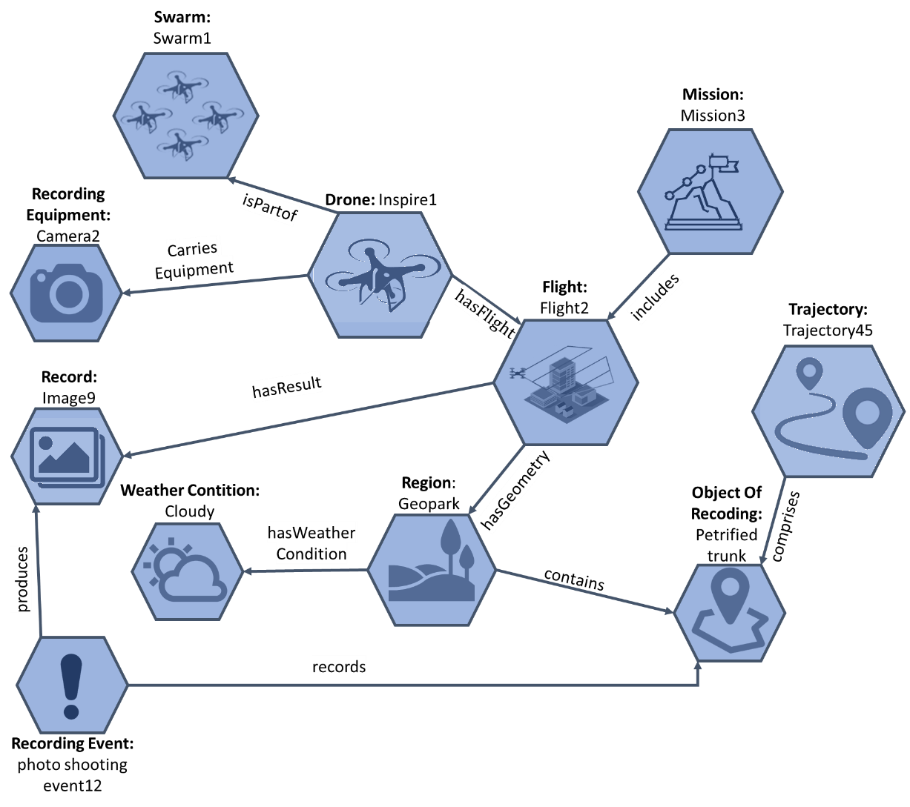
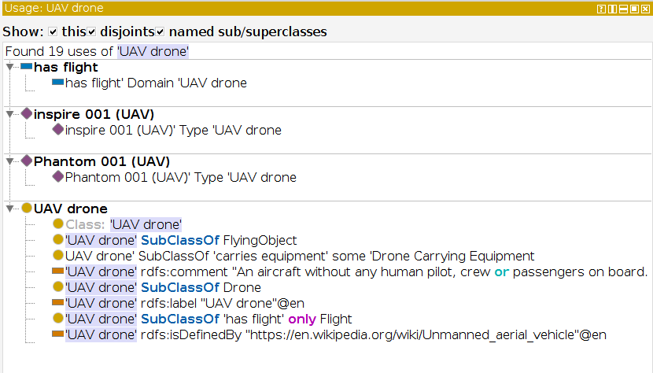
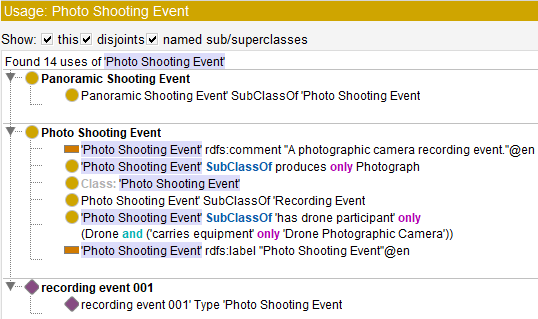

# onto4drone
The aim of the ontology is to represent knowledge related to drones' semantic trajectories (flights, missions, recordings). Reuses datAcron ontology (http://ai-group.ds.unipi.gr/datacron_ontology/).

Ontology IRI: http://i-lab.aegean.gr/kotis/Ontologies/Onto4drone
Ontology proposed prefix: dront

OWL file: https://i-lab.aegean.gr/kotis/Ontologies/Onto4drone/Onto4drone.owl

---

*<b>Figure 1.</b> Example KG representing knowledge related to a drone trajectory followed during a documentation mission in the GeoPark of Lesvos island*
---
### Concept Map

*<b>Figure 2.</b> Basic concepts and relations of the semantic model representing drones and recording episodes*

---
### Example object properties, individuals, restrictions, and annotations



*<b>Figure 3.</b> The object properties, individuals, restrictions, and annotations of the class UAV Drone of the Onto4drone ontology (version 1.0.0)*


*<b>Figure 4.</b> The object properties, individuals, restrictions, and annotations of the class Recording Event of the Onto4drone ontology (version 1.0.0).*




*<b>Figure 5.</b> The object properties, individuals, restrictions, and annotations of the class PhotoShootingEvent of the Onto4drone ontology (version 1.0.0)*

---
### Example SPARQL queries for evaluation

```
PREFIX rdf: <http://www.w3.org/1999/02/22-rdf-syntax-ns#>
PREFIX owl: <http://www.w3.org/2002/07/owl#>
PREFIX rdfs: <http://www.w3.org/2000/01/rdf-schema#>
PREFIX xsd: <http://www.w3.org/2001/XMLSchema#>
PREFIX dront: <http://i-lab.aegean.gr/kotis/ontologies/onto4drone#>
PREFIX datacron: <http://www.datacron-project.eu/datAcron#>
PREFIX opengis: <http://www.opengis.net/ont/sf#>
PREFIX sosa: <http://www.w3.org/ns/sosa/>
SELECT * WHERE { 
	dront:m_001 dront:includesFlight ?flight .
	?flight sosa:hasResult ?records .
	dront:petrifiedTrunk dront:isRecordedIn ?records.
}
```


*<b>Figure 6.</b> Example query “which flights of mission1 resulted in records that include a specific object of interest, namely, a petrified trunk”*
---
What are the weather conditions and temperature at the recorded points when recording the object of interest, pertified trunk


```
PREFIX rdf: <http://www.w3.org/1999/02/22-rdf-syntax-ns#>
PREFIX owl: <http://www.w3.org/2002/07/owl#>
PREFIX rdfs: <http://www.w3.org/2000/01/rdf-schema#>
PREFIX xsd: <http://www.w3.org/2001/XMLSchema#>
PREFIX dront: <http://i-lab.aegean.gr/kotis/ontologies/onto4drone#>
PREFIX datacron: <http://www.datacron-project.eu/datAcron#>
PREFIX opengis: <http://www.opengis.net/ont/sf#>
PREFIX sosa: <http://www.w3.org/ns/sosa/>
SELECT ?position ?weather ?temprature WHERE {
    dront:petrifiedTrunk dront:isRecordedIn ?record.
    ?rec_event dront:produces ?record.
    ?rec_event datacron:occurs ?position.
    ?position datacron:hasWeatherCondition ?weather.
    ?weather datacron:reportedMaxTemperature ?temperature.
}
```


*<b>Figure 7.</b> Example query “what are the weather conditions and temperature at the recording points while recording a specific object of interest, namely, a petrified trunk”*
---

